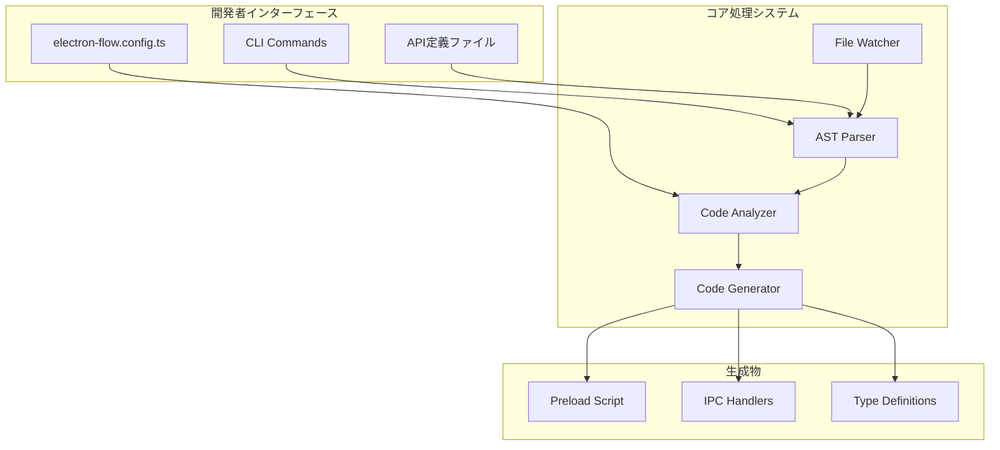
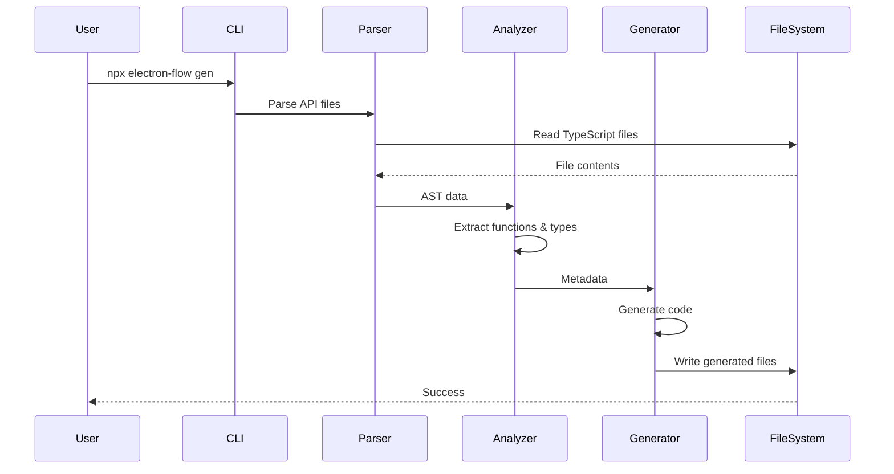

# システム全体設計書

## 1. システム概要

### 1.1 プロジェクト概要
electron-flowは、Electronアプリケーション開発におけるIPC（Inter-Process Communication）通信の複雑さを解消するための自動コード生成ツールです。TypeScriptで定義されたAPIから、型安全なIPC通信コードを自動生成し、開発者がビジネスロジックに集中できる環境を提供します。

### 1.2 システムの目的
- Electron IPC通信の実装を自動化し、開発効率を向上
- 型安全性を保証し、ランタイムエラーを削減
- 設定駆動型アプローチによる保守性の向上
- エラーハンドリングの一元管理

### 1.3 主要機能
1. **自動コード生成**: TypeScript APIからIPC通信コードを自動生成
2. **型安全性保証**: コンパイル時の型チェックによる安全性向上
3. **設定管理**: 単一設定ファイルによる一元管理
4. **エラーハンドリング**: カスタマイズ可能なエラー処理機構

## 2. システムアーキテクチャ

### 2.1 全体構成図



### 2.2 レイヤーアーキテクチャ

```
┌─────────────────────────────────────┐
│      Presentation Layer             │
│  (CLI Interface / Commands)         │
├─────────────────────────────────────┤
│      Application Layer              │
│  (Build Process / Watch Mode)       │
├─────────────────────────────────────┤
│      Domain Layer                   │
│  (Code Analysis / Generation)       │
├─────────────────────────────────────┤
│      Infrastructure Layer           │
│  (File System / TypeScript API)    │
└─────────────────────────────────────┘
```

## 3. コンポーネント設計

### 3.1 主要コンポーネント

#### 3.1.1 CLI Interface
- **責務**: ユーザーコマンドの受付と実行
- **主要コマンド**:
  - `init`: プロジェクト初期化
  - `gen`: コード生成

#### 3.1.2 Code Analysis Engine
- **責務**: TypeScriptファイルの解析とメタデータ抽出
- **サブコンポーネント**:
  - AST Parser: 抽象構文木の解析
  - Type Extractor: 型情報の抽出
  - Zod Schema Analyzer: Zodスキーマの解析

#### 3.1.3 Code Generation Engine
- **責務**: 解析結果から各種コードの生成
- **生成対象**:
  - Preload Scripts
  - IPC Handlers
  - Type Definitions

#### 3.1.4 File System Manager
- **責務**: ファイルの読み書きと監視
- **機能**:
  - ファイル変更検知
  - ビルドロック管理

### 3.2 コンポーネント間相互作用



## 4. 技術スタック

### 4.1 コア技術
- **言語**: TypeScript 5+
- **ランタイム**: Node.js 22+
- **パッケージマネージャー**: npm

### 4.2 主要依存関係
- **TypeScript Compiler API**: AST解析とコード生成
- **Zod**: スキーマ定義と検証
- **Chokidar**: ファイル監視機能

### 4.3 生成コードの対象環境
- **Electron**: 最新版対応
- **IPC通信**: invoke/handle パターン使用

## 5. セキュリティ設計

### 5.1 基本方針
- IPC通信の入力検証を自動実装
- 型安全性による不正データの防止
- エラー情報の適切な隠蔽

### 5.2 セキュリティ機能
- Zodスキーマによる自動バリデーション
- Context型による認証情報の管理
- エラーハンドリングでの情報漏洩防止

## 6. パフォーマンス設計

### 6.1 最適化戦略
- インクリメンタルビルドの実装
- ファイル監視時のデバウンス処理
- 並列処理による高速化

### 6.2 スケーラビリティ
- 大規模プロジェクトへの対応
- モジュール単位での処理分割
- キャッシュ機構の活用

## 7. 拡張性設計

### 7.1 プラグインアーキテクチャ
将来的な拡張ポイント：
- カスタムコードジェネレーター
- 追加の検証ルール
- 異なるフレームワークへの対応

### 7.2 設定の拡張性
- カスタムエラーハンドラー
- 生成コードのテンプレート
- 追加の生成オプション

## 8. 運用設計

### 8.1 ロギング
- ビルドプロセスの詳細ログ
- エラー発生時の診断情報
- パフォーマンスメトリクス

### 8.2 エラーハンドリング
- 段階的なエラー処理
- ユーザーフレンドリーなエラーメッセージ
- リカバリー機能

## 9. 制約事項

### 9.1 技術的制約
- TypeScript 5以上が必要
- Node.js 22以上が必要
- Electronアプリケーション専用

### 9.2 設計上の制約
- APIファイルは特定の形式に準拠する必要
- Zodスキーマの使用が前提
- 単一のContextパラメータパターン

## 10. 今後の拡張計画

### 10.1 短期計画
- パフォーマンス改善
- エラーメッセージの改善
- ドキュメントの充実

### 10.2 長期計画
- プラグインシステムの実装
- 他のバリデーションライブラリへの対応
- WebSocket通信のサポート