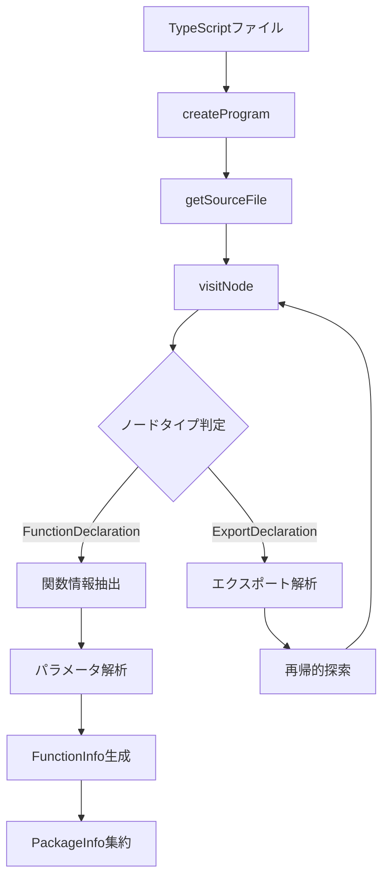
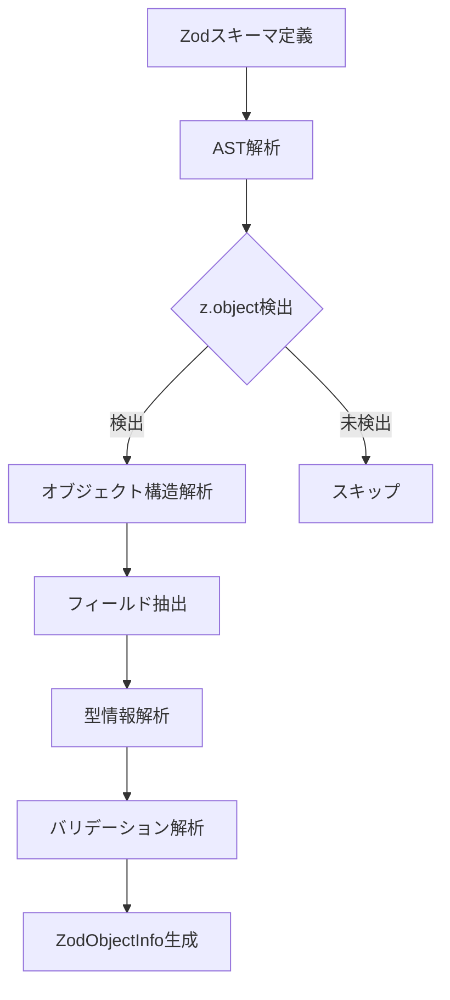
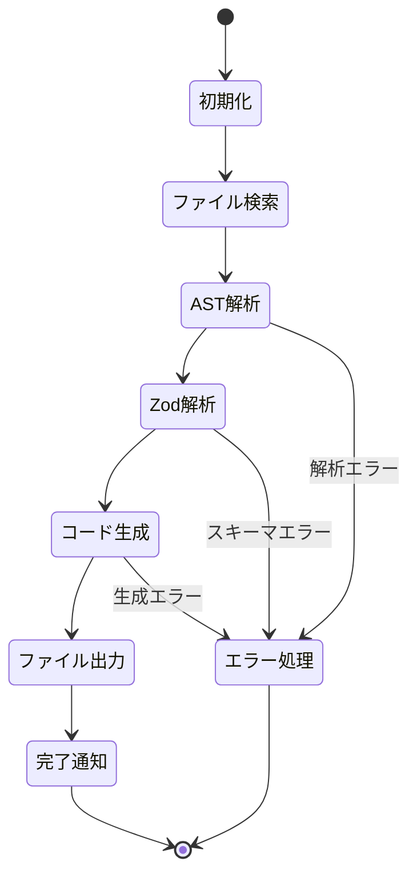
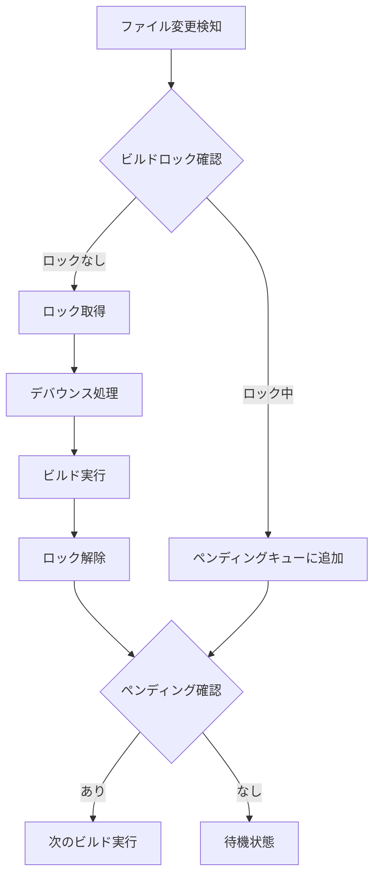

# モジュール詳細設計書

## 1. モジュール構成概要

electron-flowは以下の主要モジュールで構成されています：

```
packages/
└── codeGenerate/              # コード生成モジュール
    ├── src/
    │   ├── parse.ts           # AST解析エンジン
    │   ├── zod.ts            # Zodスキーマ解析
    │   ├── format.ts         # コード生成エンジン
    │   ├── build.ts          # ビルドプロセス管理
    │   └── watch.ts          # ファイル監視機能
    └── index.ts              # エクスポート定義
```

## 2. codeGenerateモジュール

### 2.1 モジュール概要
**責務**: TypeScript APIファイルからElectron IPC通信コードを自動生成

### 2.2 主要インターフェース

```typescript
// ビルド関数
export async function build(option: AutoCodeOption): Promise<{
    zodObjectInfos: ZodObjectInfo[];
    packages: PackageInfo[];
}>

// 監視モード付きビルド
export async function watchBuild(option: AutoCodeOption): Promise<void>
```

## 3. parse.ts - AST解析エンジン

### 3.1 設計概要
TypeScript Compiler APIを使用してソースコードを解析し、関数情報を抽出します。

### 3.2 主要クラス/インターフェース

```typescript
interface FunctionInfo {
    name: string;                    // 関数名
    request: ParamInfo[];           // パラメータ情報
    response: string;               // 戻り値の型
    isAsync: boolean;               // 非同期関数かどうか
    filePath: string;               // ソースファイルパス
    importPath: string;             // インポートパス
}

interface ParamInfo {
    name: string;                   // パラメータ名
    type: string;                   // 型情報
    isOptional: boolean;            // オプショナルパラメータか
    defaultValue?: string;          // デフォルト値
}

interface PackageInfo {
    packageName: string;            // パッケージ名
    functions: FunctionInfo[];      // 関数情報リスト
}
```

### 3.3 処理フロー



### 3.4 主要メソッド

```typescript
class ASTParser {
    // TypeScriptプログラムの作成
    private createProgram(filePaths: string[]): ts.Program
    
    // ソースファイルの解析
    private parseSourceFile(sourceFile: ts.SourceFile): FunctionInfo[]
    
    // 関数宣言の解析
    private parseFunctionDeclaration(node: ts.FunctionDeclaration): FunctionInfo
    
    // パラメータの解析
    private parseParameters(params: ts.NodeArray<ts.ParameterDeclaration>): ParamInfo[]
    
    // 型情報の抽出
    private extractTypeInfo(typeNode: ts.TypeNode): string
}
```

## 4. zod.ts - Zodスキーマ解析

### 4.1 設計概要
Zodオブジェクトの定義を解析し、スキーマ情報を抽出します。

### 4.2 主要インターフェース

```typescript
interface ZodObjectInfo {
    name: string;                   // スキーマ名
    path: string;                   // ファイルパス
    fields: FieldInfo[];            // フィールド情報
    importPath: string;             // インポートパス
}

interface FieldInfo {
    name: string;                   // フィールド名
    type: ZodType;                  // Zodタイプ
    isOptional: boolean;            // オプショナルか
    defaultValue?: any;             // デフォルト値
    validations?: ValidationInfo[]; // バリデーション情報
}

enum ZodType {
    STRING = 'string',
    NUMBER = 'number',
    BOOLEAN = 'boolean',
    DATE = 'date',
    OBJECT = 'object',
    ARRAY = 'array',
    ENUM = 'enum',
    UNION = 'union',
    LITERAL = 'literal'
}
```

### 4.3 処理フロー



### 4.4 主要メソッド

```typescript
class ZodSchemaAnalyzer {
    // Zodスキーマの検出
    private detectZodSchema(node: ts.Node): boolean
    
    // スキーマ情報の抽出
    private extractSchemaInfo(node: ts.CallExpression): ZodObjectInfo
    
    // フィールド情報の解析
    private parseFields(objectLiteral: ts.ObjectLiteralExpression): FieldInfo[]
    
    // Zodタイプの判定
    private determineZodType(expression: ts.Expression): ZodType
    
    // バリデーション情報の抽出
    private extractValidations(chainedCalls: ts.CallExpression[]): ValidationInfo[]
}
```

## 5. format.ts - コード生成エンジン

### 5.1 設計概要
解析した情報を基に、3種類のコードを生成します。

### 5.2 生成対象

#### 5.2.1 プリロードスクリプト
```typescript
// 生成例
window.electronAPI = {
    createUser: (name: string, email: string) => 
        ipcRenderer.invoke('createUser', name, email),
    getUsers: () => 
        ipcRenderer.invoke('getUsers')
}
```

#### 5.2.2 IPCハンドラー
```typescript
// 生成例
export const autoGenerateHandlers = {
    "createUser": (baseCtx: Omit<Context, "event">) => {
        return async (event: IpcMainInvokeEvent, args: any) => {
            const ctx: Context = { ...baseCtx, event };
            try {
                const result = await createUser(ctx, args);
                return { success: true, data: result };
            } catch (error) {
                return handleError(error, ctx);
            }
        };
    }
}
```

#### 5.2.3 型定義
```typescript
// 生成例
interface ElectronAPI {
    createUser: (name: string, email: string) => Promise<Result<User>>;
    getUsers: () => Promise<Result<User[]>>;
}
```

### 5.3 コード生成クラス

```typescript
class CodeGenerator {
    // プリロードスクリプト生成
    generatePreloadScript(packages: PackageInfo[]): string
    
    // ハンドラーコード生成
    generateHandlers(
        packages: PackageInfo[], 
        errorHandler?: ErrorHandlerConfig
    ): string
    
    // 型定義生成
    generateTypeDefinitions(
        packages: PackageInfo[],
        zodInfos: ZodObjectInfo[]
    ): string
    
    // インポート文生成
    private generateImports(dependencies: ImportInfo[]): string
    
    // 関数シグネチャ生成
    private generateFunctionSignature(func: FunctionInfo): string
}
```

### 5.4 テンプレートエンジン

```typescript
interface CodeTemplate {
    preloadTemplate: string;
    handlerTemplate: string;
    typeDefTemplate: string;
}

class TemplateEngine {
    // テンプレートの読み込み
    loadTemplates(): CodeTemplate
    
    // 変数の置換
    interpolate(template: string, variables: Record<string, any>): string
    
    // コードフォーマット
    format(code: string): string
}
```

## 6. build.ts - ビルドプロセス管理

### 6.1 設計概要
全体のビルドプロセスを管理し、各モジュールを協調動作させます。

### 6.2 ビルドプロセス



### 6.3 主要クラス

```typescript
class BuildManager {
    private parser: ASTParser;
    private zodAnalyzer: ZodSchemaAnalyzer;
    private generator: CodeGenerator;
    private fileManager: FileManager;
    
    // ビルドプロセス実行
    async build(option: AutoCodeOption): Promise<BuildResult>
    
    // ファイル検索
    private async findTargetFiles(targetPath: string): Promise<string[]>
    
    // 解析フェーズ
    private async analyzePhase(files: string[]): Promise<AnalysisResult>
    
    // 生成フェーズ
    private async generatePhase(analysis: AnalysisResult): Promise<GeneratedCode>
    
    // 出力フェーズ
    private async outputPhase(code: GeneratedCode, option: AutoCodeOption): Promise<void>
}
```

## 7. watch.ts - ファイル監視機能

### 7.1 設計概要
ファイルの変更を監視し、自動的に再ビルドを実行します。

### 7.2 監視設計

```typescript
class FileWatcher {
    private watcher: FSWatcher;
    private buildLock: boolean = false;
    private pendingBuilds: Set<string> = new Set();
    
    // 監視開始
    async startWatching(option: AutoCodeOption): Promise<void>
    
    // ファイル変更ハンドラー
    private handleFileChange(filePath: string): void
    
    // デバウンス付きビルド
    private debouncedBuild = debounce(this.executeBuild, 300)
    
    // ビルド実行
    private async executeBuild(): Promise<void>
    
    // ロック管理
    private async withLock<T>(fn: () => Promise<T>): Promise<T>
}
```

### 7.3 イベント処理



## 8. エラー処理設計

### 8.1 エラー階層

```typescript
// 基底エラークラス
class ElectronFlowError extends Error {
    constructor(
        message: string,
        public code: string,
        public details?: any
    ) {
        super(message);
    }
}

// 解析エラー
class ParseError extends ElectronFlowError {
    constructor(filePath: string, details: any) {
        super(
            `Failed to parse ${filePath}`,
            'PARSE_ERROR',
            details
        );
    }
}

// 生成エラー
class GenerationError extends ElectronFlowError {
    constructor(target: string, details: any) {
        super(
            `Failed to generate ${target}`,
            'GENERATION_ERROR',
            details
        );
    }
}
```

## 9. 設定管理

### 9.1 設定検証

```typescript
class ConfigValidator {
    // 設定の検証
    validate(config: AutoCodeOption): ValidationResult
    
    // パスの検証
    private validatePaths(config: AutoCodeOption): string[]
    
    // オプションの検証
    private validateOptions(config: AutoCodeOption): string[]
    
    // デフォルト値の適用
    applyDefaults(config: Partial<AutoCodeOption>): AutoCodeOption
}
```

## 10. パフォーマンス最適化

### 10.1 キャッシュ設計

```typescript
class BuildCache {
    private cache: Map<string, CacheEntry>;
    
    // キャッシュエントリ
    interface CacheEntry {
        hash: string;
        result: AnalysisResult;
        timestamp: number;
    }
    
    // キャッシュの取得
    get(filePath: string): AnalysisResult | null
    
    // キャッシュの設定
    set(filePath: string, result: AnalysisResult): void
    
    // キャッシュの無効化
    invalidate(filePath: string): void
}
```

### 10.2 並列処理

```typescript
class ParallelProcessor {
    // 並列解析
    async analyzeInParallel(
        files: string[],
        concurrency: number = 4
    ): Promise<AnalysisResult[]>
    
    // バッチ処理
    private processBatch<T>(
        items: T[],
        processor: (item: T) => Promise<any>,
        batchSize: number
    ): Promise<any[]>
}
```

## 11. テスト設計

### 11.1 ユニットテスト対象

- 各モジュールの個別機能
- エラーケースの処理
- エッジケースの検証

### 11.2 統合テスト対象

- エンドツーエンドのビルドプロセス
- ファイル監視機能
- エラーリカバリー

