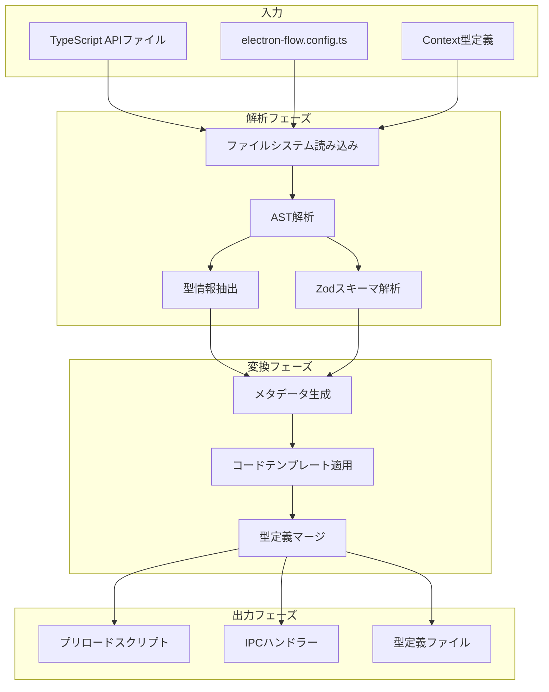
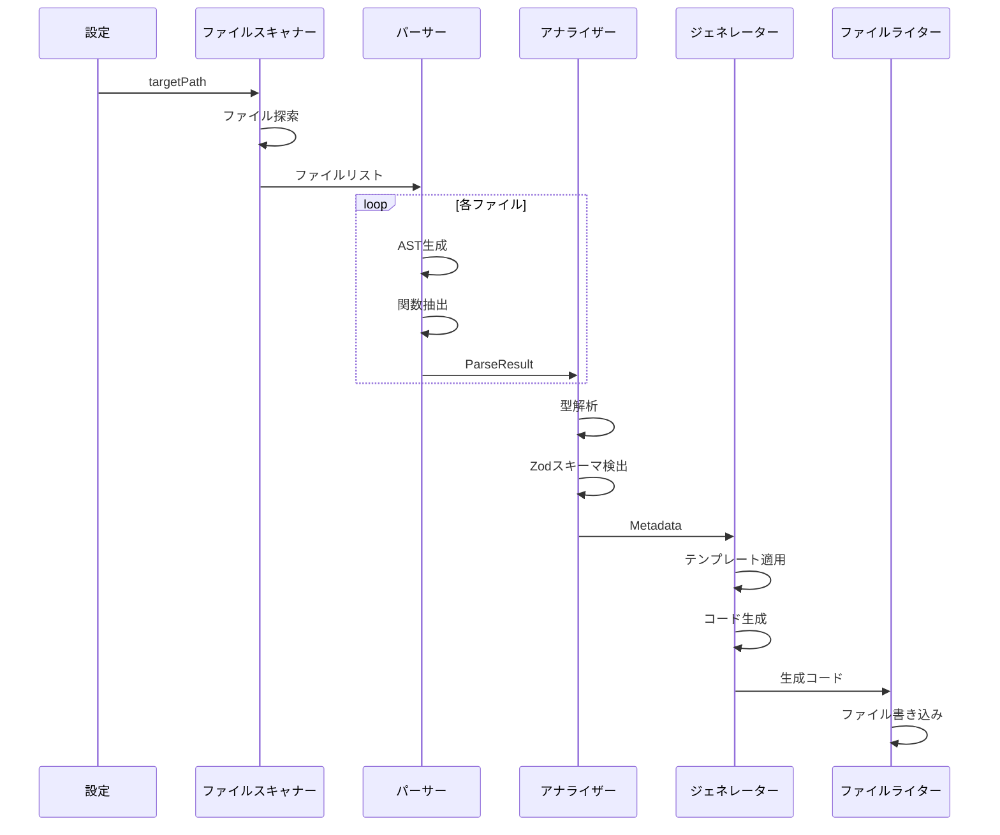
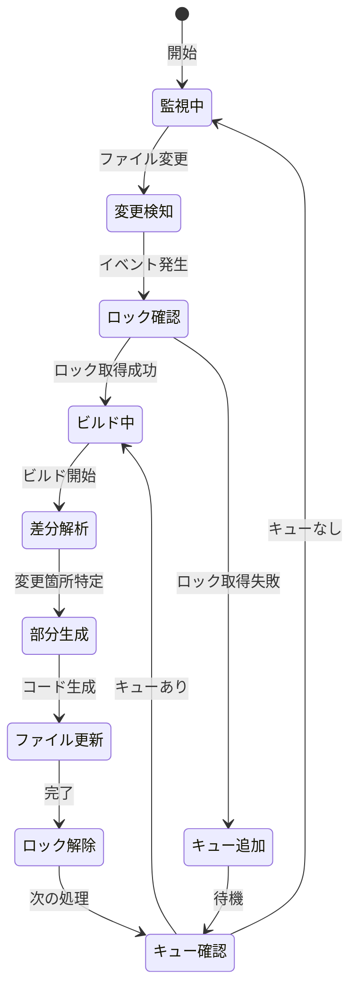
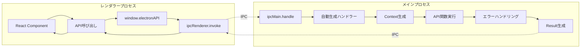
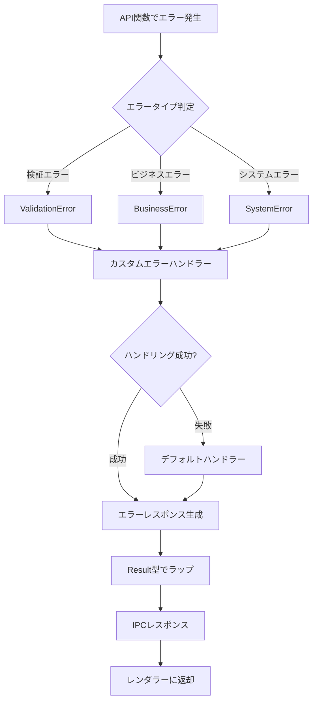
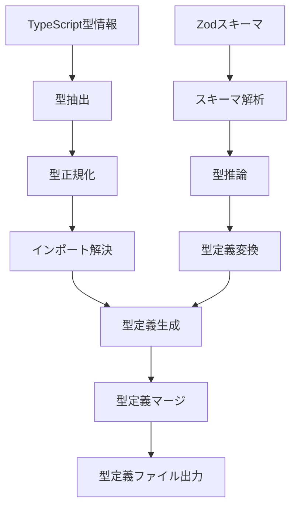
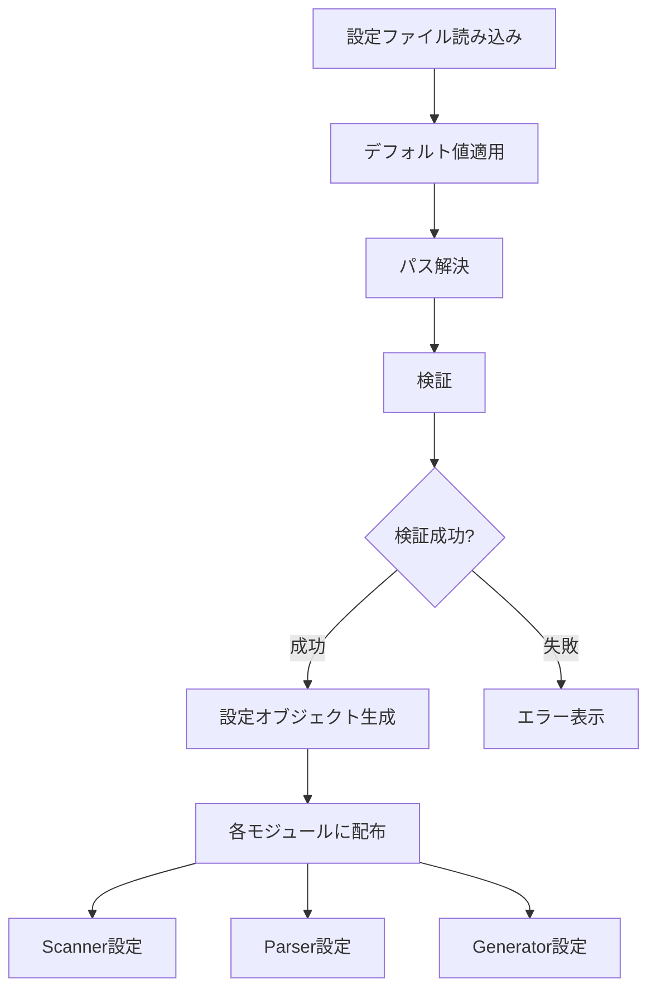
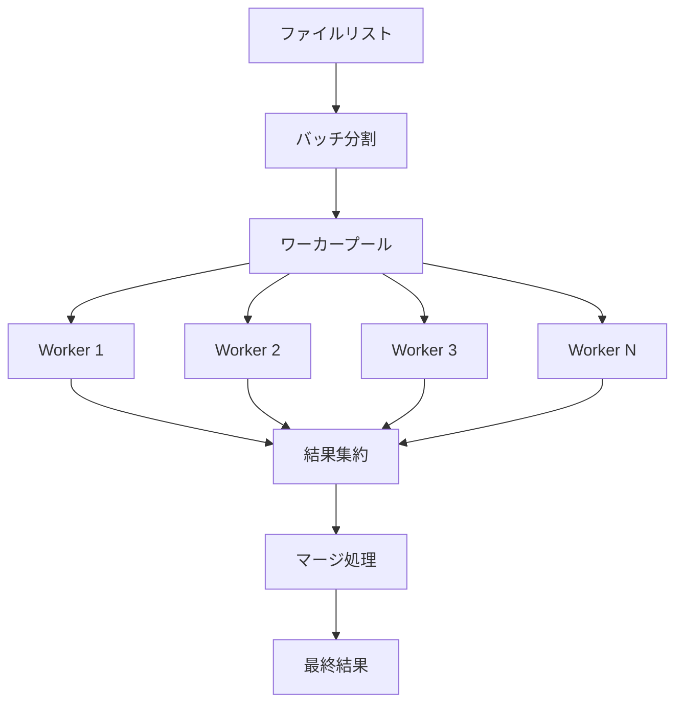

# データフロー設計書

## 1. データフロー概要

electron-flowにおけるデータフローは、大きく2つのフェーズに分かれます：

1. **ビルドフェーズ** - TypeScriptコードの解析から生成まで
2. **ランタイムフェーズ** - 生成されたコードによるIPC通信

## 2. ビルドフェーズのデータフロー

### 2.1 全体フロー図



### 2.2 詳細データ構造

#### 2.2.1 入力データ構造

```typescript
// ファイル読み込み結果
interface FileContent {
    path: string;
    content: string;
    hash: string;
    lastModified: Date;
}

// 設定データ
interface ConfigData {
    option: AutoCodeOption;
    resolvedPaths: {
        targetPath: string;
        preloadPath: string;
        registerPath: string;
        rendererPath: string;
        contextPath?: string;
    };
}
```

#### 2.2.2 解析フェーズのデータ

```typescript
// AST解析結果
interface ParseResult {
    sourceFile: ts.SourceFile;
    functions: FunctionInfo[];
    imports: ImportInfo[];
    exports: ExportInfo[];
}

// 関数情報
interface FunctionInfo {
    name: string;
    parameters: ParameterInfo[];
    returnType: TypeInfo;
    isAsync: boolean;
    decorators?: DecoratorInfo[];
    jsDoc?: JSDocInfo;
}

// パラメータ情報
interface ParameterInfo {
    name: string;
    type: TypeInfo;
    isOptional: boolean;
    defaultValue?: string;
    position: number;
}

// 型情報
interface TypeInfo {
    text: string;
    kind: ts.TypeFlags;
    isArray: boolean;
    isPromise: boolean;
    genericArgs?: TypeInfo[];
}
```

#### 2.2.3 Zodスキーマ解析データ

```typescript
// Zodオブジェクト情報
interface ZodObjectInfo {
    name: string;
    path: string;
    schema: ZodSchema;
    dependencies: string[];
}

// Zodスキーマ構造
interface ZodSchema {
    type: 'object' | 'array' | 'union' | 'primitive';
    properties?: Record<string, ZodField>;
    items?: ZodSchema;
    options?: ZodSchema[];
}

// Zodフィールド情報
interface ZodField {
    type: string;
    optional: boolean;
    nullable: boolean;
    defaultValue?: any;
    validators: Validator[];
}
```

#### 2.2.4 変換フェーズのデータ

```typescript
// 統合メタデータ
interface Metadata {
    packages: PackageMetadata[];
    schemas: SchemaMetadata[];
    dependencies: DependencyGraph;
}

// パッケージメタデータ
interface PackageMetadata {
    name: string;
    path: string;
    functions: EnrichedFunctionInfo[];
    imports: ResolvedImport[];
}

// 拡張関数情報
interface EnrichedFunctionInfo extends FunctionInfo {
    ipcChannelName: string;
    validationSchema?: string;
    contextRequired: boolean;
}

// 依存グラフ
interface DependencyGraph {
    nodes: Map<string, DependencyNode>;
    edges: DependencyEdge[];
}
```

### 2.3 コード生成プロセス



## 3. ファイル監視モードのデータフロー

### 3.1 イベント駆動フロー



### 3.2 差分ビルドのデータ構造

```typescript
// ファイル変更イベント
interface FileChangeEvent {
    type: 'add' | 'change' | 'unlink';
    path: string;
    timestamp: Date;
}

// ビルドキュー
interface BuildQueue {
    events: FileChangeEvent[];
    processing: boolean;
    lastBuildTime: Date;
}

// 差分解析結果
interface DiffAnalysis {
    added: string[];
    modified: string[];
    removed: string[];
    affected: string[];  // 依存関係で影響を受けるファイル
}

// キャッシュデータ
interface CacheData {
    fileHash: Map<string, string>;
    parseResults: Map<string, ParseResult>;
    metadata: Map<string, Metadata>;
}
```

## 4. ランタイムフェーズのデータフロー

### 4.1 IPC通信フロー



### 4.2 リクエスト/レスポンスデータ

```typescript
// IPCリクエスト
interface IPCRequest {
    channel: string;
    args: any[];
    timestamp: number;
    requestId?: string;
}

// IPCレスポンス
interface IPCResponse<T> {
    success: boolean;
    data?: T;
    error?: ErrorDetails;
    timestamp: number;
    requestId?: string;
}

// Context生成データ
interface ContextData {
    event: IpcMainInvokeEvent;
    baseContext: Omit<Context, 'event'>;
    metadata: {
        channel: string;
        timestamp: number;
        processInfo: ProcessInfo;
    };
}
```

## 5. エラー伝播フロー

### 5.1 エラー処理チェーン



### 5.2 エラーデータ構造

```typescript
// エラー情報の伝播
interface ErrorFlow {
    originalError: Error;
    processedError: ProcessedError;
    response: ErrorResponse;
}

// 処理済みエラー
interface ProcessedError {
    message: string;
    type: string;
    code?: string;
    statusCode?: number;
    details?: any;
    stack?: string;  // 開発環境のみ
}

// エラーレスポンス
interface ErrorResponse {
    success: false;
    error: {
        message: string;
        type: string;
        details?: any;
    };
}
```

## 6. 型情報の伝播

### 6.1 型定義の生成フロー



### 6.2 型変換ルール

```typescript
// 型変換マッピング
interface TypeMapping {
    // TypeScript型 -> 生成型
    primitives: {
        'string': 'string';
        'number': 'number';
        'boolean': 'boolean';
        'Date': 'Date';
        'Buffer': 'Buffer';
    };
    
    // 複合型の変換
    complex: {
        'Promise<T>': 'Promise<Result<T>>';
        'Array<T>': 'T[]';
        'Record<K, V>': '{ [key: K]: V }';
    };
}

// 型変換プロセス
interface TypeTransformation {
    input: TypeInfo;
    normalized: NormalizedType;
    output: GeneratedType;
}
```

## 7. 設定データの適用フロー

### 7.1 設定の解決プロセス



### 7.2 設定の適用データ

```typescript
// 設定解決結果
interface ResolvedConfig {
    original: AutoCodeOption;
    resolved: {
        paths: ResolvedPaths;
        options: ResolvedOptions;
        errorHandler?: ResolvedErrorHandler;
    };
    validation: ValidationResult;
}

// 解決済みパス
interface ResolvedPaths {
    targetPath: string;
    preloadPath: string;
    registerPath: string;
    rendererPath: string;
    contextPath: string;
    workingDir: string;
}

// 解決済みオプション
interface ResolvedOptions {
    ignores: RegExp[];
    concurrency: number;
    cache: boolean;
    debug: boolean;
    logLevel: LogLevel;
}
```

## 8. パフォーマンス最適化のデータフロー

### 8.1 キャッシュ機構

```typescript
// キャッシュシステム
interface CacheSystem {
    // ファイルキャッシュ
    fileCache: Map<string, FileCacheEntry>;
    
    // 解析結果キャッシュ
    parseCache: Map<string, ParseCacheEntry>;
    
    // 生成コードキャッシュ
    generatedCache: Map<string, GeneratedCacheEntry>;
}

// キャッシュエントリ
interface FileCacheEntry {
    path: string;
    content: string;
    hash: string;
    timestamp: Date;
    dependencies: string[];
}

interface ParseCacheEntry {
    fileHash: string;
    result: ParseResult;
    timestamp: Date;
}

interface GeneratedCacheEntry {
    inputHash: string;
    code: string;
    timestamp: Date;
}
```

### 8.2 並列処理フロー



## 9. デバッグ情報の収集

### 9.1 トレースデータ

```typescript
// トレース情報
interface TraceData {
    id: string;
    phase: 'scan' | 'parse' | 'analyze' | 'generate' | 'write';
    startTime: number;
    endTime?: number;
    data: any;
    children: TraceData[];
}

// パフォーマンスメトリクス
interface PerformanceMetrics {
    totalTime: number;
    phases: {
        scan: number;
        parse: number;
        analyze: number;
        generate: number;
        write: number;
    };
    fileCount: number;
    functionCount: number;
}
```

## 10. データ整合性の保証

### 10.1 トランザクション管理

```typescript
// ビルドトランザクション
interface BuildTransaction {
    id: string;
    startTime: Date;
    state: 'pending' | 'running' | 'completed' | 'failed';
    
    // ロールバック情報
    rollback: {
        files: Array<{
            path: string;
            originalContent?: string;
        }>;
    };
    
    // コミット
    commit(): Promise<void>;
    
    // ロールバック
    rollback(): Promise<void>;
}
```