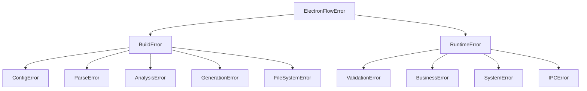
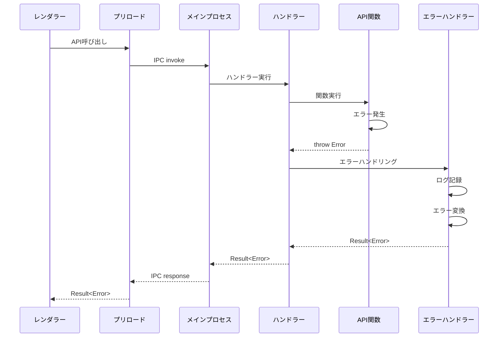

# エラーハンドリング設計書

## 1. エラーハンドリング概要

electron-flowは、開発時とランタイムの両方で堅牢なエラーハンドリングを提供します。エラーは適切に分類され、ユーザーフレンドリーなメッセージと共に処理されます。

### 1.1 エラーハンドリングの原則

1. **早期検出** - エラーは可能な限り早期に検出
2. **明確な分類** - エラーの種類を明確に分類
3. **有用な情報** - デバッグに必要な情報を提供
4. **優雅な回復** - 可能な限りシステムの継続動作を維持
5. **セキュリティ** - 機密情報の漏洩を防止

## 2. エラー分類体系

### 2.1 エラーカテゴリ

```typescript
enum ErrorCategory {
    // ビルド時エラー
    CONFIGURATION = 'CONFIGURATION',      // 設定エラー
    PARSING = 'PARSING',                 // 構文解析エラー
    ANALYSIS = 'ANALYSIS',               // 型解析エラー
    GENERATION = 'GENERATION',           // コード生成エラー
    FILE_SYSTEM = 'FILE_SYSTEM',         // ファイルシステムエラー
    
    // ランタイムエラー
    VALIDATION = 'VALIDATION',           // バリデーションエラー
    BUSINESS = 'BUSINESS',               // ビジネスロジックエラー
    SYSTEM = 'SYSTEM',                   // システムエラー
    IPC = 'IPC',                        // IPC通信エラー
    UNKNOWN = 'UNKNOWN'                  // 不明なエラー
}
```

### 2.2 エラー階層構造



## 3. ビルド時エラーハンドリング

### 3.1 設定エラー

```typescript
class ConfigError extends BuildError {
    constructor(
        message: string,
        public field?: string,
        public providedValue?: any,
        public expectedType?: string
    ) {
        super(
            message,
            'CONFIG_ERROR',
            ErrorCategory.CONFIGURATION,
            {
                field,
                providedValue,
                expectedType,
                configPath: process.cwd() + '/electron-flow.config.ts'
            }
        );
    }
    
    // エラーメッセージのフォーマット
    format(): string {
        let msg = this.message;
        if (this.field) {
            msg += `\n  Field: ${this.field}`;
        }
        if (this.providedValue !== undefined) {
            msg += `\n  Provided: ${JSON.stringify(this.providedValue)}`;
        }
        if (this.expectedType) {
            msg += `\n  Expected: ${this.expectedType}`;
        }
        return msg;
    }
}
```

### 3.2 構文解析エラー

```typescript
class ParseError extends BuildError {
    constructor(
        message: string,
        public filePath: string,
        public line?: number,
        public column?: number,
        public syntaxError?: ts.Diagnostic
    ) {
        super(
            message,
            'PARSE_ERROR',
            ErrorCategory.PARSING,
            {
                filePath,
                location: { line, column },
                syntaxError: syntaxError ? {
                    code: syntaxError.code,
                    category: ts.DiagnosticCategory[syntaxError.category],
                    messageText: syntaxError.messageText
                } : undefined
            }
        );
    }
    
    // コードスニペットの生成
    getCodeSnippet(context: number = 3): string {
        // ファイルからエラー箇所周辺のコードを抽出
        const lines = this.readFileLines();
        const start = Math.max(0, (this.line || 1) - context - 1);
        const end = Math.min(lines.length, (this.line || 1) + context);
        
        return lines.slice(start, end)
            .map((line, i) => {
                const lineNum = start + i + 1;
                const marker = lineNum === this.line ? '>' : ' ';
                return `${marker} ${lineNum.toString().padStart(4)} | ${line}`;
            })
            .join('\n');
    }
}
```

### 3.3 コード生成エラー

```typescript
class GenerationError extends BuildError {
    constructor(
        message: string,
        public target: 'preload' | 'handler' | 'types',
        public functionName?: string,
        public reason?: string
    ) {
        super(
            message,
            'GENERATION_ERROR',
            ErrorCategory.GENERATION,
            {
                target,
                functionName,
                reason,
                timestamp: new Date().toISOString()
            }
        );
    }
    
    // 回復提案の生成
    getSuggestions(): string[] {
        const suggestions: string[] = [];
        
        if (this.reason?.includes('type')) {
            suggestions.push('Ensure all types are properly exported');
            suggestions.push('Check for circular dependencies');
        }
        
        if (this.target === 'preload') {
            suggestions.push('Verify that all API functions follow the required pattern');
        }
        
        return suggestions;
    }
}
```

## 4. ランタイムエラーハンドリング

### 4.1 Result型による統一的なエラー処理

```typescript
// 成功/失敗を表現する統一型
type Result<T, E = ErrorDetails> = 
    | { success: true; data: T }
    | { success: false; error: E };

// エラー詳細情報
interface ErrorDetails {
    message: string;
    type: string;
    code?: string;
    details?: any;
    timestamp: string;
    requestId?: string;
}

// Result型のユーティリティ関数
class ResultUtils {
    static ok<T>(data: T): Result<T> {
        return { success: true, data };
    }
    
    static error<E = ErrorDetails>(error: E): Result<never, E> {
        return { success: false, error };
    }
    
    static fromPromise<T>(
        promise: Promise<T>,
        errorTransform?: (error: any) => ErrorDetails
    ): Promise<Result<T>> {
        return promise
            .then(data => ResultUtils.ok(data))
            .catch(error => ResultUtils.error(
                errorTransform ? errorTransform(error) : {
                    message: error.message || 'Unknown error',
                    type: error.constructor.name,
                    timestamp: new Date().toISOString()
                }
            ));
    }
}
```

### 4.2 バリデーションエラー

```typescript
class ValidationError extends RuntimeError {
    constructor(
        message: string,
        public field: string,
        public value: any,
        public constraint: string,
        public zodError?: z.ZodError
    ) {
        super(
            message,
            'VALIDATION_ERROR',
            ErrorCategory.VALIDATION,
            {
                field,
                value,
                constraint,
                issues: zodError?.issues
            }
        );
    }
    
    // ユーザー向けメッセージの生成
    toUserMessage(): string {
        if (this.zodError) {
            return this.zodError.issues
                .map(issue => `${issue.path.join('.')}: ${issue.message}`)
                .join(', ');
        }
        return `${this.field}: ${this.constraint}`;
    }
}

// Zodエラーの変換
function transformZodError(error: z.ZodError): ValidationError {
    const firstIssue = error.issues[0];
    return new ValidationError(
        'Validation failed',
        firstIssue.path.join('.'),
        firstIssue.code,
        firstIssue.message,
        error
    );
}
```

### 4.3 IPC通信エラー

```typescript
class IPCError extends RuntimeError {
    constructor(
        message: string,
        public channel: string,
        public direction: 'send' | 'receive',
        public originalError?: Error
    ) {
        super(
            message,
            'IPC_ERROR',
            ErrorCategory.IPC,
            {
                channel,
                direction,
                processType: process.type,
                originalMessage: originalError?.message
            }
        );
    }
    
    // リトライ可能かどうかの判定
    isRetryable(): boolean {
        // タイムアウトや一時的なエラーはリトライ可能
        const retryableMessages = [
            'timeout',
            'EAGAIN',
            'ECONNRESET',
            'ETIMEDOUT'
        ];
        
        return retryableMessages.some(msg => 
            this.message.toLowerCase().includes(msg.toLowerCase())
        );
    }
}
```

## 5. カスタムエラーハンドラー

### 5.1 エラーハンドラーインターフェース

```typescript
// エラーハンドラーの型定義
type ErrorHandler = (
    error: Error,
    context: Context
) => Result<never>;

// エラーハンドラーの設定
interface ErrorHandlerConfig {
    handlerPath: string;
    handlerName: string;
    defaultHandler?: boolean;
}

// エラーハンドラーのラッパー
class ErrorHandlerWrapper {
    constructor(
        private customHandler?: ErrorHandler,
        private useDefaultFallback: boolean = false
    ) {}
    
    handle(error: Error, context: Context): Result<never> {
        try {
            if (this.customHandler) {
                return this.customHandler(error, context);
            }
        } catch (handlerError) {
            console.error('Error in custom error handler:', handlerError);
            if (!this.useDefaultFallback) {
                throw handlerError;
            }
        }
        
        // デフォルトハンドラーにフォールバック
        return this.defaultHandler(error, context);
    }
    
    private defaultHandler(error: Error, context: Context): Result<never> {
        return {
            success: false,
            error: {
                message: this.sanitizeErrorMessage(error.message),
                type: error.constructor.name,
                timestamp: new Date().toISOString()
            }
        };
    }
    
    private sanitizeErrorMessage(message: string): string {
        // 機密情報を除去
        return message
            .replace(/\/[^\/\s]+\/[^\/\s]+/g, '/***/***/') // パスを隠蔽
            .replace(/\b[A-Za-z0-9._%+-]+@[A-Za-z0-9.-]+\.[A-Z|a-z]{2,}\b/g, '***@***.***') // メールを隠蔽
            .replace(/\b(?:\d{1,3}\.){3}\d{1,3}\b/g, '***.***.***.***'); // IPアドレスを隠蔽
    }
}
```

### 5.2 カスタムエラーハンドラー実装例

```typescript
// プロジェクト固有のエラーハンドラー
export function projectErrorHandler(
    error: Error,
    context: Context
): Result<never> {
    // ロギング
    context.logger.error('API Error', {
        error: {
            name: error.name,
            message: error.message,
            stack: error.stack
        },
        context: {
            user: context.user?.id,
            channel: context.event.sender.id
        }
    });
    
    // エラー分析とメトリクス送信
    sendErrorMetrics(error, context);
    
    // エラータイプに応じた処理
    if (error instanceof ValidationError) {
        return {
            success: false,
            error: {
                message: error.toUserMessage(),
                type: 'VALIDATION_ERROR',
                code: 'E_VALIDATION',
                details: {
                    field: error.field,
                    constraint: error.constraint
                },
                timestamp: new Date().toISOString()
            }
        };
    }
    
    if (error instanceof UnauthorizedError) {
        return {
            success: false,
            error: {
                message: 'Authentication required',
                type: 'AUTH_ERROR',
                code: 'E_UNAUTHORIZED',
                timestamp: new Date().toISOString()
            }
        };
    }
    
    // その他のエラー
    const isDevelopment = process.env.NODE_ENV === 'development';
    return {
        success: false,
        error: {
            message: isDevelopment ? error.message : 'An error occurred',
            type: error.constructor.name,
            code: 'E_INTERNAL',
            details: isDevelopment ? { stack: error.stack } : undefined,
            timestamp: new Date().toISOString()
        }
    };
}
```

## 6. エラー伝播とロギング

### 6.1 エラー伝播チェーン



### 6.2 エラーロギング設計

```typescript
interface ErrorLog {
    timestamp: string;
    level: 'error' | 'warn';
    category: ErrorCategory;
    error: {
        name: string;
        message: string;
        code?: string;
        stack?: string;
    };
    context: {
        processType: 'main' | 'renderer';
        channel?: string;
        userId?: string;
        sessionId?: string;
    };
    metadata?: Record<string, any>;
}

class ErrorLogger {
    private transport: LogTransport;
    
    log(error: Error, context: Context, metadata?: any): void {
        const errorLog: ErrorLog = {
            timestamp: new Date().toISOString(),
            level: this.determineLevel(error),
            category: this.categorizeError(error),
            error: {
                name: error.name,
                message: error.message,
                code: (error as any).code,
                stack: this.shouldIncludeStack() ? error.stack : undefined
            },
            context: {
                processType: process.type as any,
                channel: context.event?.sender?.id,
                userId: context.user?.id,
                sessionId: context.sessionId
            },
            metadata
        };
        
        this.transport.send(errorLog);
    }
    
    private determineLevel(error: Error): 'error' | 'warn' {
        if (error instanceof ValidationError) return 'warn';
        if (error instanceof BusinessError) return 'warn';
        return 'error';
    }
    
    private categorizeError(error: Error): ErrorCategory {
        if (error instanceof ConfigError) return ErrorCategory.CONFIGURATION;
        if (error instanceof ParseError) return ErrorCategory.PARSING;
        if (error instanceof ValidationError) return ErrorCategory.VALIDATION;
        // ... その他の分類
        return ErrorCategory.UNKNOWN;
    }
    
    private shouldIncludeStack(): boolean {
        return process.env.NODE_ENV === 'development' || 
               process.env.LOG_LEVEL === 'debug';
    }
}
```

## 7. エラーリカバリー戦略

### 7.1 自動リカバリー

```typescript
class ErrorRecovery {
    // リトライメカニズム
    static async withRetry<T>(
        fn: () => Promise<T>,
        options: RetryOptions = {}
    ): Promise<T> {
        const {
            maxAttempts = 3,
            delay = 1000,
            backoff = 2,
            retryIf = () => true
        } = options;
        
        let lastError: Error;
        
        for (let attempt = 1; attempt <= maxAttempts; attempt++) {
            try {
                return await fn();
            } catch (error) {
                lastError = error as Error;
                
                if (attempt === maxAttempts || !retryIf(error)) {
                    throw error;
                }
                
                const waitTime = delay * Math.pow(backoff, attempt - 1);
                await new Promise(resolve => setTimeout(resolve, waitTime));
            }
        }
        
        throw lastError!;
    }
    
    // フォールバック処理
    static async withFallback<T>(
        primary: () => Promise<T>,
        fallback: () => Promise<T>
    ): Promise<T> {
        try {
            return await primary();
        } catch (error) {
            console.warn('Primary operation failed, using fallback:', error);
            return await fallback();
        }
    }
}

interface RetryOptions {
    maxAttempts?: number;
    delay?: number;
    backoff?: number;
    retryIf?: (error: any) => boolean;
}
```

### 7.2 部分的失敗の処理

```typescript
// バッチ処理での部分的失敗
interface BatchResult<T> {
    successful: T[];
    failed: Array<{
        item: any;
        error: Error;
    }>;
}

class BatchProcessor {
    static async processBatch<T, R>(
        items: T[],
        processor: (item: T) => Promise<R>,
        options: { continueOnError?: boolean } = {}
    ): Promise<BatchResult<R>> {
        const result: BatchResult<R> = {
            successful: [],
            failed: []
        };
        
        for (const item of items) {
            try {
                const processed = await processor(item);
                result.successful.push(processed);
            } catch (error) {
                result.failed.push({
                    item,
                    error: error as Error
                });
                
                if (!options.continueOnError) {
                    throw new BatchProcessingError(
                        'Batch processing failed',
                        result
                    );
                }
            }
        }
        
        return result;
    }
}
```

## 8. エラー監視とアラート

### 8.1 エラーメトリクス

```typescript
interface ErrorMetrics {
    // エラー頻度
    frequency: {
        total: number;
        byCategory: Record<ErrorCategory, number>;
        byType: Record<string, number>;
    };
    
    // エラー率
    rate: {
        overall: number;  // エラー数 / 総リクエスト数
        byEndpoint: Record<string, number>;
    };
    
    // レスポンスタイム影響
    performance: {
        averageRecoveryTime: number;
        impactedRequests: number;
    };
}

class ErrorMonitor {
    private metrics: ErrorMetrics;
    private alertThresholds: AlertThresholds;
    
    recordError(error: Error, context: Context): void {
        // メトリクスの更新
        this.updateMetrics(error);
        
        // アラートのチェック
        this.checkAlerts();
    }
    
    private checkAlerts(): void {
        if (this.metrics.rate.overall > this.alertThresholds.errorRate) {
            this.sendAlert('High error rate detected', this.metrics);
        }
        
        // その他のアラート条件
    }
}
```

## 9. 開発者向けエラー情報

### 9.1 エラーレポート生成

```typescript
class ErrorReporter {
    static generateReport(error: BuildError): string {
        const report = [
            '═══════════════════════════════════════',
            `ERROR: ${error.name}`,
            '═══════════════════════════════════════',
            '',
            `Message: ${error.message}`,
            `Category: ${error.category}`,
            `Code: ${error.code}`,
            ''
        ];
        
        if (error instanceof ParseError && error.line) {
            report.push('Location:');
            report.push(`  File: ${error.filePath}`);
            report.push(`  Line: ${error.line}, Column: ${error.column || 0}`);
            report.push('');
            report.push('Code:');
            report.push(error.getCodeSnippet());
            report.push('');
        }
        
        if (error instanceof GenerationError) {
            const suggestions = error.getSuggestions();
            if (suggestions.length > 0) {
                report.push('Suggestions:');
                suggestions.forEach(s => report.push(`  - ${s}`));
                report.push('');
            }
        }
        
        report.push('Stack Trace:');
        report.push(error.stack || 'No stack trace available');
        
        return report.join('\n');
    }
}
```

## 10. エラーハンドリングのベストプラクティス

### 10.1 実装ガイドライン

1. **具体的なエラータイプを使用**
   ```typescript
   // 良い例
   throw new ValidationError('Invalid email format', 'email', value, 'email');
   
   // 悪い例
   throw new Error('Invalid input');
   ```

2. **コンテキスト情報を含める**
   ```typescript
   // 良い例
   throw new ParseError(
       'Unexpected token',
       filePath,
       line,
       column,
       diagnostic
   );
   ```

3. **エラーメッセージは開発者向けとユーザー向けを分離**
   ```typescript
   class BusinessError extends RuntimeError {
       constructor(
           developerMessage: string,
           public userMessage: string,
           details?: any
       ) {
           super(developerMessage, 'BUSINESS_ERROR', ErrorCategory.BUSINESS, details);
       }
   }
   ```

### 10.2 テスト戦略

```typescript
// エラーケースのテスト
describe('Error Handling', () => {
    it('should handle validation errors correctly', async () => {
        const result = await api.createUser({ name: '', email: 'invalid' });
        
        expect(result.success).toBe(false);
        expect(result.error.type).toBe('VALIDATION_ERROR');
        expect(result.error.details).toHaveProperty('field');
    });
    
    it('should recover from transient errors', async () => {
        // トランジェントエラーのシミュレーション
        let attempts = 0;
        const result = await ErrorRecovery.withRetry(async () => {
            attempts++;
            if (attempts < 3) throw new Error('Temporary failure');
            return 'success';
        });
        
        expect(result).toBe('success');
        expect(attempts).toBe(3);
    });
});
```