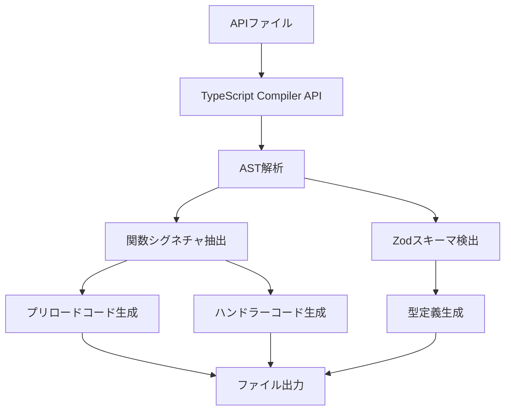

# アーキテクチャガイド

electron-flowの設計思想、内部構造、拡張方法について詳しく解説します。

> 初めてお使いの方は[README](./README.md)から開始することをお勧めします。

## 設計思想

electron-flowは「開発者がビジネスロジックに集中できる」という思想のもと設計されています。Electronアプリケーション開発において最も複雑で手間のかかるIPC通信の実装を自動化し、型安全性を保証することで開発効率を大幅に向上させます。

### 核となる設計原則

1. **自動化優先** - 手動実装が必要な箇所を最小限に
2. **型安全性の保証** - コンパイル時にすべてのIPC通信の型チェックを実施
3. **設定駆動** - 一度の設定ですべてが動作する
4. **拡張性** - プロジェクトの成長に合わせて柔軟に対応

## システム全体像

electron-flowは核となる機能で構成されます：

1. **自動コード生成** - TypeScript APIから型安全なIPC通信コードを生成

## モジュール構成

```
packages/                  # 核となる機能モジュール
└── codeGenerate/         # 自動コード生成
```

## 詳細設計原則

### 1. 型安全性を最優先とした設計

従来のElectronアプリケーションでは、レンダラーとメインプロセス間の通信で型安全性が失われがちでした。electron-flowは、TypeScriptの型システムを活用してコンパイル時に型チェックを保証します。

```typescript
// APIの定義（メインプロセス）
export const createUserSchema = z.object({
    name: z.string(),
    email: z.string(),
});
export type CreateUserRequest = z.infer<typeof createUserSchema>;

export async function createUser(ctx: Context, request: CreateUserRequest) {
    return await ctx.db.users.create({ data: request });
}

// 自動生成される型定義（レンダラー）
interface autogenerateAPI {
    createUser: (request: CreateUserRequest) => Promise<Result<User>>;
}
```

これにより、開発者は型エラーを事前に発見でき、安全なアプリケーション開発が可能になります。

### 2. 設定駆動による一貫性

複雑な設定を一箇所に集約し、設定を変更するだけで全体の動作を制御できます。この設計により、プロジェクトの規模が大きくなっても管理が容易になります。

```typescript
export const autoCodeOption: AutoCodeOption = {
    targetPath: "./src/main/api",    // API探索対象
    ignores: [],                     // 除外設定
    preloadPath: "...",             // 生成先設定
    errorHandler: { /* カスタムエラーハンドリング */ }
};
```


## 自動コード生成システム

### 概要

TypeScript Compiler APIを使用してAPIファイルを解析し、Electron IPC通信に必要なコードを自動生成します。

### 処理フロー



### 主要コンポーネント

#### 1. parse.ts - AST解析エンジン

```typescript
// 主要な解析対象
interface FunctionInfo {
    name: string;           // 関数名
    request: ParamInfo[];   // パラメータ情報
    response: string;       // 戻り値型
}

interface ParamInfo {
    name: string;   // パラメータ名
    type: string;   // 型情報
}
```

#### 2. zod.ts - スキーマ解析

Zodオブジェクトのランタイム情報を抽出し、型情報との対応を取ります。

```typescript
interface ZodObjectInfo {
    name: string;       // スキーマ名
    path: string;       // ファイルパス
    fields: FieldInfo[]; // フィールド情報
}
```

#### 3. format.ts - コード生成

解析した情報を基に、以下の3種類のコードを生成します：

- **プリロードコード**: レンダラーからメインへのIPC呼び出し
- **ハンドラーコード**: メインプロセスでのIPC受信処理
- **型定義**: レンダラー用TypeScript型定義

### 4. 柔軟なエラーハンドリング設計

ライブラリ側では基本的なエラーハンドリング構造のみを提供し、具体的なエラー処理はプロジェクト側でカスタマイズできる設計です。これにより、プロジェクトの要件に応じたエラー処理戦略を実装できます。

この設計により、ログ記録、エラー報告、国際化対応など、プロジェクト固有の要件に応じたエラー処理が可能になります。

具体的な実装例と詳細な設定方法については[API リファレンス - エラーハンドリング](./02-API-REFERENCE.md#エラーハンドリング)を参照してください。


---

具体的な設定方法と技術仕様については[API リファレンス](./02-API-REFERENCE.md)を参照してください。