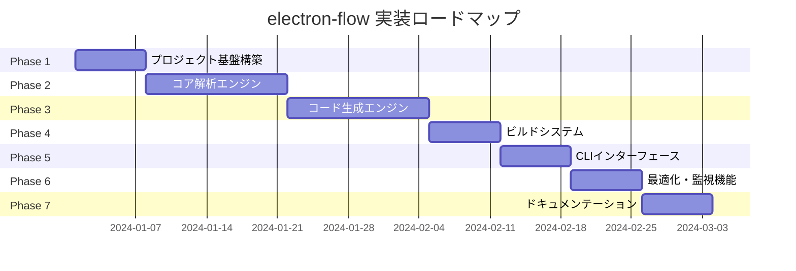
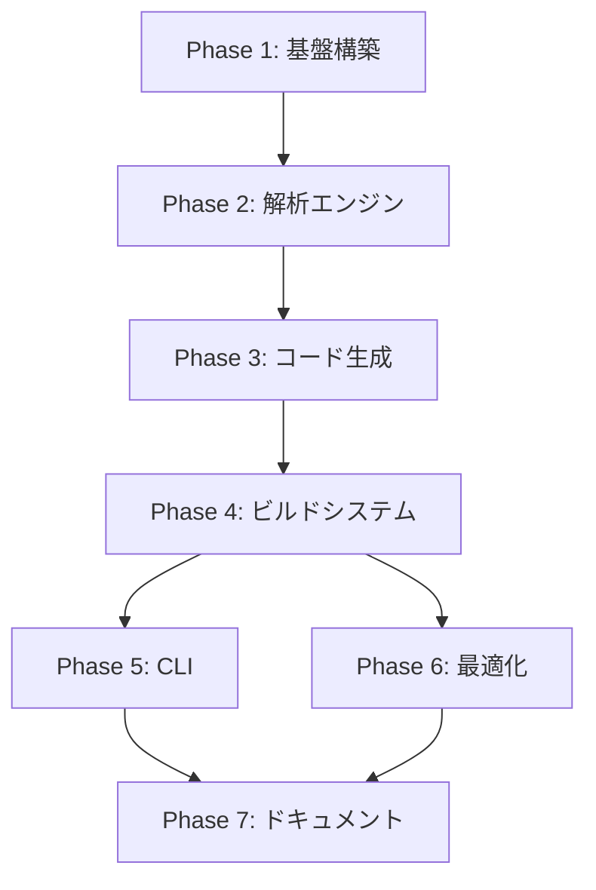

# electron-flow 実装作業計画 概要

## 1. プロジェクト概要

electron-flowは、Electronアプリケーション開発におけるIPC通信の複雑さを解消するための自動コード生成ツールです。TypeScriptで定義されたAPIから、型安全なIPC通信コードを自動生成し、開発効率を大幅に向上させます。

## 2. 全体ロードマップ

## 3. フェーズ別概要

### Phase 1: プロジェクト基盤構築 (Week 1)
**目標**: 開発環境とプロジェクト構造の確立
- **期間**: 1週間
- **主要成果物**: プロジェクト構造、設定ファイル、開発環境
- **完了基準**: TypeScriptビルドが通り、基本的なテストが実行可能

### Phase 2: コア解析エンジン (Week 2-3)
**目標**: TypeScript AST解析とZodスキーマ解析機能の実装
- **期間**: 2週間
- **主要成果物**: parse.ts、zod.ts モジュール
- **完了基準**: TypeScript APIファイルから関数情報とスキーマ情報を正確に抽出

### Phase 3: コード生成エンジン (Week 4-5)
**目標**: 解析結果からIPC通信コードを生成する機能の実装
- **期間**: 2週間
- **主要成果物**: format.ts モジュール、テンプレートシステム
- **完了基準**: プリロード、ハンドラー、型定義の3種類のコードが正確に生成

### Phase 4: ビルドシステム (Week 6)
**目標**: 全体的なビルドプロセスの統合と管理
- **期間**: 1週間
- **主要成果物**: build.ts モジュール、設定管理システム
- **完了基準**: 設定ファイルに基づいた完全なビルドプロセスが動作

### Phase 5: CLIインターフェース (Week 7)
**目標**: ユーザー向けコマンドラインインターフェースの実装
- **期間**: 1週間
- **主要成果物**: initコマンド、genコマンド
- **完了基準**: 基本的なCLI操作でプロジェクトの初期化とコード生成が可能

### Phase 6: 最適化・監視機能 (Week 8)
**目標**: パフォーマンス最適化とファイル監視機能の実装
- **期間**: 1週間
- **主要成果物**: watch.ts モジュール、キャッシュシステム
- **完了基準**: ファイル変更の自動検知と差分ビルドが動作

### Phase 7: ドキュメンテーション (Week 9)
**目標**: ユーザードキュメントとAPIドキュメントの完成
- **期間**: 1週間
- **主要成果物**: ユーザーガイド、APIドキュメント、サンプルプロジェクト
- **完了基準**: 第三者がドキュメントのみでプロジェクトを使用可能

## 4. フェーズ間依存関係

## 5. 主要マイルストーン

| マイルストーン | 期限 | 達成基準 |
|---|---|---|
| **M1: 基盤完成** | Week 1 | プロジェクト構造とビルド環境が整備済み |
| **M2: 解析機能完成** | Week 3 | TypeScript APIとZodスキーマの解析が動作 |
| **M3: 生成機能完成** | Week 5 | 3種類のコード生成が動作 |
| **M4: CLI完成** | Week 7 | 基本的なCLI操作が完全動作 |
| **M5: 最適化完成** | Week 8 | ファイル監視と差分ビルドが動作 |
| **M6: リリース準備完了** | Week 9 | ドキュメント完成、リリース可能状態 |

## 6. リスク管理

### 高リスク項目
1. **TypeScript Compiler API の複雑性**
   - **リスク**: AST解析の実装が予想以上に複雑
   - **対策**: Phase 2で十分な調査時間を確保、プロトタイプ先行開発

2. **Zodスキーマの動的解析**
   - **リスク**: ランタイム情報の静的解析が困難
   - **対策**: 解析可能な範囲を明確に定義、段階的実装

3. **コード生成の品質**
   - **リスク**: 生成されるコードが実用的でない
   - **対策**: 早期にサンプルプロジェクトでの検証を実施

### 中リスク項目
1. **パフォーマンス要件**
   - **リスク**: 大規模プロジェクトでの処理速度
   - **対策**: Phase 6でベンチマークテストを実施

2. **エラーハンドリングの複雑性**
   - **リスク**: 多様なエラーケースへの対応
   - **対策**: 段階的なエラーハンドリング実装

## 7. 品質基準

### コード品質
- **TypeScript strict mode**: 有効
- **ESLint/Prettier**: 設定済み
- **型安全性**: すべてのpublic APIが型安全
- **コードレビュー**: すべての変更を複数人でレビュー

### パフォーマンス
- **ビルド時間**: 100ファイル未満で5秒以内
- **メモリ使用量**: 500MB以内
- **ファイル監視**: 変更検知から再ビルドまで1秒以内

### ユーザビリティ
- **エラーメッセージ**: 具体的で解決策を含む
- **CLI操作**: 直感的で一貫性のあるインターフェース
- **ドキュメント**: 第三者が理解可能な品質

## 8. 成功基準

### 技術的成功基準
1. TypeScript APIから完全な型安全性を保ってIPC通信コードを生成
2. 大規模プロジェクト（100+API関数）での実用的なパフォーマンス
3. 既存のElectronプロジェクトへの段階的導入が可能
4. 実際のElectronアプリでの動作確認

### ビジネス的成功基準
1. 開発効率の大幅向上（IPC通信実装時間を80%削減）
2. 型エラーによるランタイムエラーの撲滅
3. 保守性の向上（API変更時の自動コード更新）

## 9. 次のステップ

1. **Phase 1 開始準備**
   - 開発環境の詳細要件確認
   - プロジェクト構造の最終確認
   - 必要なツールとライブラリの選定

2. **チーム体制確認**
   - 各フェーズの担当者割り当て
   - レビュープロセスの確立
   - コミュニケーション方法の確立

3. **継続的改善**
   - 各フェーズ終了時の振り返り実施
   - 計画の見直しと調整
   - リスク対策の効果測定